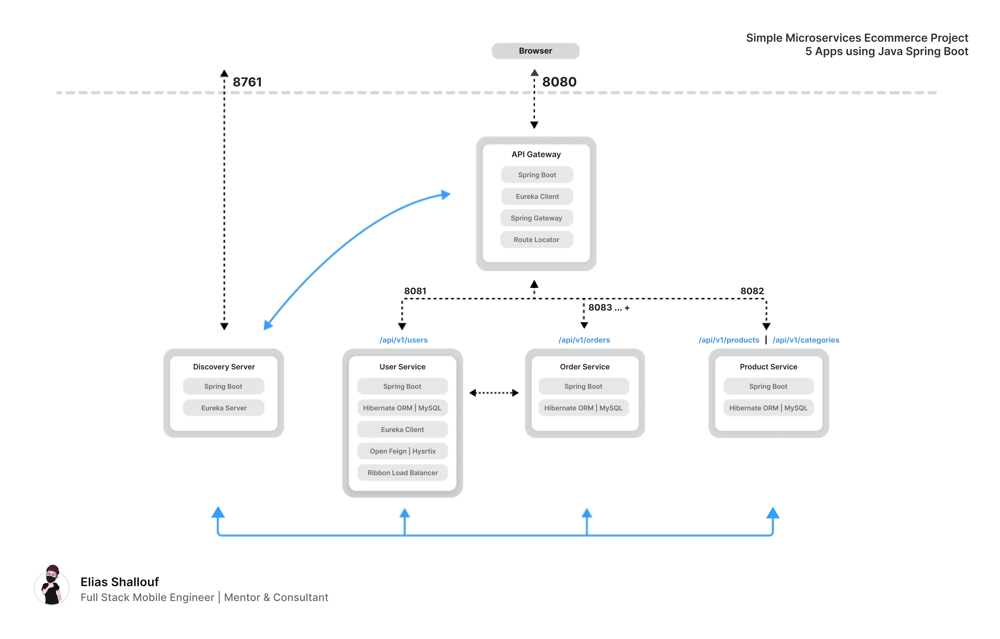

# Simple Microservices Ecommerece System

<picture>
  <source media="(prefers-color-scheme: dark)" srcset="diagram.png">
  <source media="(prefers-color-scheme: light)" srcset="diagram.png">
  
</picture>

#### Dive into the world of Spring Boot microservices with this hands-on project, which implements robust microservice communication with Feign, graceful failure handling with Hystrix, and efficient load balancing with Ribbon.
___

> ### This project addresses the following scenario
> 
>We have a simple ecommerece system that have 3 main apps (products app, orders app and users app) which the user app can connect to the orders app and give the users the ablitiy to create, list and get total of their orders, and the products app is responsible for products and categories management.
><br/>The entry point in this system will be the API-Gateway (which will run on the port 8080) app which will act as a bridge between the client and the system's apps based on the API Endpoints URL pattern,
><br/>And, to enable the dynamic scanning of this all apps, we have a discovery server built with Euerka Server.
><br/>And, beacuse of the orders app is the most heavy app and will have the most traffic on it, so we may need more than one instance of it and beacuse of that a ribbon load balancer have used to detect all of this app's instances and redirect the request to the best avaliable instance.
><br/>Finally, here is the full app list:
>1. API Gateway: runs on port 8080, which is the main access server to the clients.
>2. Discovery Server: runs on port 8761, and we can use it to log all the current scanned apps;
>3. Users Service: runs on port 8081.
>4. Orders Service: runs on port 8083...+ (if there is multi-instance it can be run on other ports like 8084...).
>5. Products Service: runs on port 8082.
>
>And, all the main 3 apps could be accessed via the API-Gateway port (_also can be accessed by its own port - if no cors have applied_).

### Stack

* Microservices Architecture
* Clean Architecture (Onion Architecture)
* Java Spring Boot
* Hibernate ORM
* MySQL
* Security (CORS)
* Euerka Discovery Server
* Euerka Discovery Client
* Open Feign Client
* Ribbon Load Balancer
* Hystrix

### What this project covers

* Building a Microservices Distributed Project.
* Building Web Apps with Spring Boot framework.
* Building REST API.
* Use Hibernate ORM to create and connect to MySQL database.
* Database CRUD examples for each db tables.
* Basic CORS configuration to make the orders app only accessed be the API Gateway and the users app.
* Create multi-instance of an app and make a simple Load Balancer.
* Connect the microservices with each other via REST API Client.
* Handle the connection failures.

### Installation and run project

1. Clone the repo and open it with any editor you like (for me, I'm obsessed with IntelliJ IDEA).
2. Create a new MySQL db called ```ecomm-db``` or any name you like (or even any SQL based dbms, *if you change the db from mysql then you must change the driver class and dialect*).
3. If you change the db name, then open ```application.properties``` file inside ```/src/main/resources/``` in each of this apps (```user-service```, ```order-service```, ```product-service```)
4. Edit ```spring.datasource.url``` (after the last forward slash ' / ') and set the proper database name (which you previously created at step 2).
5. If you have another db user info from (root with empty password) then modify this 2 properties ```spring.datasource.username``` and ```spring.datasource.password```.
6. Finally, just run the projects as orderd here:
    1. run ```discovery-server``` app.
    2. run ```api-gateway``` app.
    3. run other apps like (```user-service```, ```order-service```, ```product-service```).
7. And then, test the API using a REST Client like Postman.

### Interact with the API using Postman
For this example, a Postman collection have added in this repo that contains all the endpoints which contained in this project, so this is how to use it:

1. Install [Postman](https://www.postman.com/downloads/).
2. Open Postman and click on ```import``` button > File > and select the cloned ```api.postman_collection.json``` file and import it.
3. Expand the ```ecomm-microservices-api``` on the collections panel in the left side.
4. Now, 3 folders will appear:
   * **_user-service_**: contains 6 endpoints for login, register and order's app related requests.
   * **_order-service_**: contains 3 endpoints that represents the CRUD opertations on the orders table, and 1 endpoint to get the total of user's orders and the final endpoint to get the current orders app server id.
   * **_product-service_**: contains 2 endpoints to create and list cateogries and 3 endpoints to create, list and find products.
5. Follow the bellow ```API Documentation``` section to learn more about each endpoint.
6. Finally, select any endpoint with the proper _(path | query parameters | body)_ and click ```Send``` button to make request and see the response in the bottom panel.

### API Documentation
#### User Service Endpoints
1. ``POST /api/v1/users/register``: register route which needs the user's details to be passed as **raw body** in json format like this
```
{
    "name": "Elias Shallouf",
    "email": "elias.m.shallouf@gmail.com",
    "password": "123"
}
```
2. ``POST /api/v1/users/login``: login route which needs the user's email and password to be passed as **raw body** in json format like this
```
{
    "email": "elias@gmail.com",
    "password": "adasd"
}
```
3. ``GET /api/v1/users/{userId}/orders``: retrieve a list of user's orders by its user id, replace ``{userId}`` with the target user id (uuid:string).
4. ``GET /api/v1/users/{userId}/orders/total``: retrieve the total of user's orders by using its user id, replace ``{userId}`` with the target user id (uuid:string).
5. ``POST /api/v1/users/{userId}/orders``: route to create an order by an user by passing the user id by replacing the ``{userId}`` with the target user id and the order details should be passed as **raw body** in json format like this
```
{
    "orderDate": "2024-06-03T02:32:50.000",
    "lines": [
        {
            "lineNumber": "1",
            "productId": "01",
            "price": "500",
            "qty": "2",
            "discount": "0"
        },
        {
            "lineNumber": "2",
            "productId": "01",
            "price": "800",
            "qty": "1",
            "discount": "0"
        }
    ]
}
```
6. ``GET /api/v1/users/order-server``: retrieve the cuurent order server id, it is just a test route to check if the load balancer works.

#### Product Service Endpoints
1. ``POST /api/v1/categories``: a route to create a category by passing its details as **raw body** in json format like this
```
{
    "name": "Meals"
}
```
2. ``GET /api/v1/categories``: a route to list the created categories.
3. ``POST /api/v1/products``: a route to create a product by passing its details as **raw body** in json format like this
```
{
    "name": "Shawrma",
    "category": {
        "id": "3ee54159-9eea-450a-af1c-1a4660d134aa"
    }
}
```
4. ``GET /api/v1/products``: a route to list the created products.
5. ``GET /api/v1/products/{productId}``: a route to find a product details by its product id, replace the ``{productId}`` with the target product's id (uuid:string).

### Order Service Endpoints
1. ``POST /api/v1/orders``: route to create an order, the order details should be passed as **raw body** in json format like this
```
{
    "userId": "c827999a-95ed-40e3-97fc-dfc297eca373",
    "orderDate": "2024-06-03T02:32:50.000",
    "lines": [
        {
            "lineNumber": "1",
            "productId": "01",
            "price": "500",
            "qty": "2",
            "discount": "0"
        },
        {
            "lineNumber": "2",
            "productId": "01",
            "price": "800",
            "qty": "1",
            "discount": "0"
        }
    ]
}
```
2. ``GET /api/v1/orders?userId={userId}``: retrieve a list of the orders that created by a user by using its id, replace ``{userId}`` with the target user id (uuid:string).
3. ``GET /api/v1/orders/total?userId={userId}``: retrieve the total of user's orders by using its user id, replace ``{userId}`` with the target user id (uuid:string).
4. ``DELETE /api/v1/orders/{orderId}``: delete an order by its id, replace the ``{orderId}`` with the target order id (uuid:string).
5. ``GET /api/v1/orders/server``: retrieve the cuurent order server id, it is just a test route to check if the load balancer works.

<br/>

___In the end, I hope that I have provided a clear explanation of the contents of this project and hope my code is comprehensive, easy, clear and simple and covers all the points that I have talked about.<br/>
If you have any questions, do not hesitate to contact me via [email](mailto://elias.m.shallouf@gmail.com).___
***
